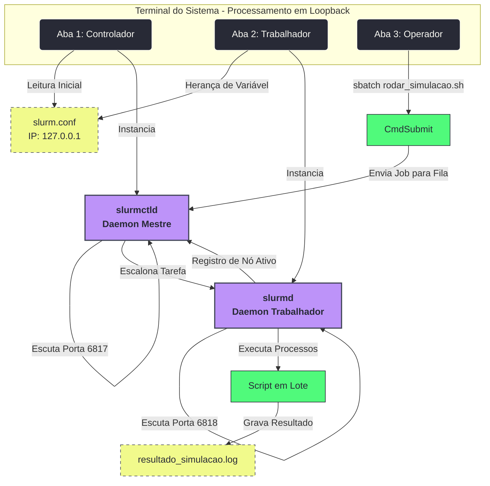

# Ambiente de Testes e Configuração de Infraestrutura Base Slurm 

Este repositório serve como uma base de infraestrutura ("carcaça de testes") para validação prática, gerenciamento de filas e monitoramento do gerenciador de recursos **Slurm Workload Manager** em ambiente local (*single-node*). O objetivo deste projeto é analisar o comportamento do Slurm como um orquestrador nativo de tarefas em lote e sistema de filas para a execução de computação paralela.

A estrutura foi projetada para simular picos de estresse de hardware através de daemons em modo de depuração e validar ferramentas de análise de desempenho, gerenciamento de processos e políticas de escalonamento diretamente no sistema operacional.

## 📚 Referências e Créditos
Este ecossistema de testes foi desenvolvido com base nos pacotes de distribuição e na documentação oficial do gerenciador:

* **Repositório de Origem (Arch Linux):** [Arch Linux AUR / slurm-llnl](https://aur.archlinux.org/packages/slurm-llnl)
* **Documentação Oficial:** [Slurm Workload Manager Documentation](https://slurm.schedmd.com/)

## 🚀 Tecnologias Utilizadas
* **Slurm 25.11+** (Gerenciador de Recursos e Agendador de Tarefas em C puro)
* **Linux Tooling:** GNU `Coreutils`, `Bash`, `systemd`
* **Compilador:** GCC 14+ (Ambiente moderno com correções estritas de tipagem)

## 📁 Estrutura do Repositório
```text
slurm-local-template/
├── images/                   # Prints das telas do terminal em execução (abas abertas)
├── README.md                 # Documentação principal e guia de logística do ecossistema
├── slurm.conf                # Arquivo de configuração limpo e otimizado para loopback local
├── rodar_simulacao.sh        # Script de lote (Batch) com diretivas #SBATCH para a fila
└── resultado_simulacao.log   # Log gerado automaticamente após o processamento da tarefa
```

🧠 O que é o Slurm e Como Ele Funciona? (A Logística por Trás)

O **Slurm (Slurm Workload Manager)** é um gerenciador de recursos de código aberto e um agendador de tarefas altamente escalável projetado para clusters Linux. Diferente de frameworks de alto nível, o Slurm opera de forma nativa diretamente sobre os recursos de hardware do sistema operacional através de uma arquitetura baseada em Daemons (serviços de segundo plano):

1. **`slurmctld` (O Controlador Mestre):** Funciona como o "cérebro" do cluster. Ele monitora os nós de computação disponíveis, aceita os scripts de jobs enviados pelos usuários, analisa as restrições de hardware solicitadas e gerencia a fila central de prioridades.
2. **`slurmd` (O Trabalhador / Node Daemon):** Roda em cada máquina de computação (nó). Ele fica em constante escuta, recebe as ordens enviadas pelo mestre, executa as tarefas locais diretamente nos núcleos da CPU e reporta o status de volta ao mestre.
3. **A Fila e as Partições:** O Slurm organiza o processamento através de partições (que funcionam como filas virtuais com regras de tempo e limites de hardware). Os Jobs entram na fila em estado de espera (`PENDING`), passam para a execução (`RUNNING`) quando os recursos são liberados, e geram um arquivo final de saída estática contendo os logs do processo.

📊 Arquitetura do Teste Local (Nó Único)

O diagrama abaixo ilustra como este repositório transforma uma máquina pessoal em uma réplica funcional de um cluster de produção, simulando as três camadas principais do Slurm (Configuração, Mestre e Nó) rodando simultaneamente em loopback:



🔧 Configuração do Ambiente Local

Siga os passos abaixo para mapear e replicar o ambiente de testes na sua máquina local Linux:

1. **Clonar o repositório:**
   ```bash
   git clone [https://github.com/m4halic3/slurm-local-template](https://github.com/m4halic3/slurm-local-template)
   cd slurm-local-template
   ``` 
2. **Copiar o arquivo de configuração para o diretório do sistema:**
   ```bash
   sudo cp slurm.conf /etc/slurm/slurm.conf
   ``` 
3. **Ajustar as permissões de segurança de arquivos do Linux:**
   ```bash
   sudo chmod 755 /etc/slurm
   sudo chmod 644 /etc/slurm/slurm.conf
   ``` 

💻 Execução e Monitoramento Local

O script `rodar_simulacao.sh` executa uma tarefa paralela simulada de temporização estruturada através de diretivas nativas `#SBATCH`. Para rodar o ecossistema completo e visualizar os dados de desempenho, siga a estratégia de abas abaixo:

1. **Iniciar o Controlador Mestre (Aba 1)**
   Avise os utilitários de usuário sobre a localização exata do arquivo de configuração e inicialize o mestre em modo de depuração interativa (`-D`) para capturar logs imediatos na tela:
   ```bash
   export SLURM_CONF=/etc/slurm/slurm.conf
   sudo /usr/bin/slurmctld -D -f /etc/slurm/slurm.conf
   ``` 

2. **Inicializar o Nó Trabalhador (Aba 2)**
   Em uma nova aba, inicialize o daemon executor. Use a flag `sudo -E` para forçar o comando de superusuário a herdar a variável `SLURM_CONF` declarada na sessão do seu usuário:
   ```bash
   sudo -E /usr/bin/slurmd -D -f /etc/slurm/slurm.conf
   ```  

3. **Executar e Monitorar os Jobs (Aba 3)**
   Com os dois serviços rodando ativamente nas telas anteriores, utilize uma terceira aba para gerenciar e disparar os testes:

   * **Checar o status de prontidão do nó local:**
     ```bash
     sinfo
     ```
     *(O nó deve aparecer listado sob a partição `local_queue` com o status `idle`, indicando estabilidade local e prontidão para computar).*

* **Submeter o script em lote para a fila:**
  ```bash
  sbatch rodar_simulacao.sh
  ```

* **Monitorar a tarefa ativa processando dinamicamente na fila:**
  ```bash
  squeue
  ```
  *Após os 10 segundos determinados pela rotina do script, o Slurm encerrará o processo e exportará a saída limpa diretamente para o arquivo local `resultado_simulacao.log`.*

4. **Encerrar os Serviços**
   Para finalizar os testes e derrubar os daemons de segundo plano de forma limpa, acesse as abas correspondentes (Aba 1 e Aba 2) e interrompa as instâncias:
   ```bash
   Ctrl + C
   ```

🌐 Escalonamento em Cluster (Ambiente Distribuído)

A portabilidade dessa configuração para um cluster físico de servidores (como um Cluster Beowulf) mantém a exata mesma lógica de rede interna, alterando apenas os alvos de endereçamento no arquivo de mapeamento:

* **Configuração de Rede Estática:** No arquivo `slurm.conf` unificado, o parâmetro `SlurmctldAddr` deixa o IP de loopback e passa a apontar para o IP estático real do servidor mestre na rede interna. Na seção inferior de nós, mapeia-se a lista exata de nomes, IPs e especificações de hardware de cada nó escravo (`NodeName=nodo01 NodeAddr=192.168.1.X ...`).
* **Segurança e Autenticação:** O mestre gerencia de forma centralizada os arquivos de autenticação criptográfica (`munge.key`) que devem ser copiados de forma idêntica para todos os nós escravos, garantindo que apenas máquinas autenticadas enviem e recebam processos dentro da infraestrutura unificada.

---

## 📄 Licença

Este projeto está sob a licença MIT — consulte o arquivo `LICENSE` para obter mais detalhes. Isso significa que você pode livremente utilizar este esqueleto de código, modificá-lo e distribuí-lo tanto para fins acadêmicos quanto comerciais.